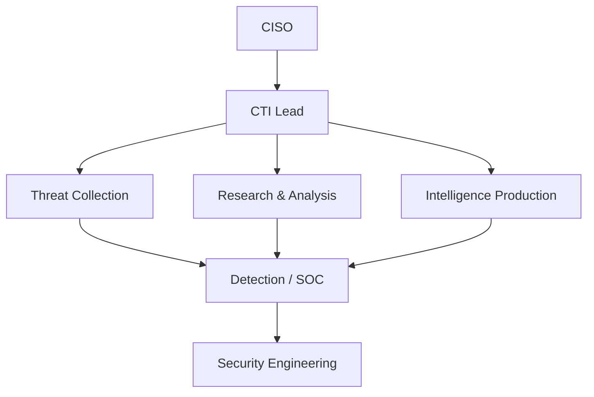
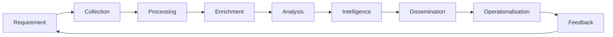
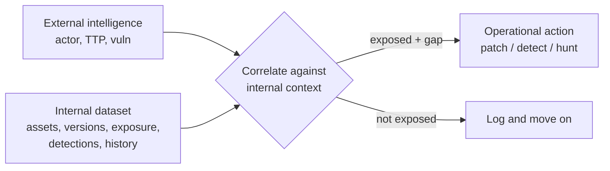
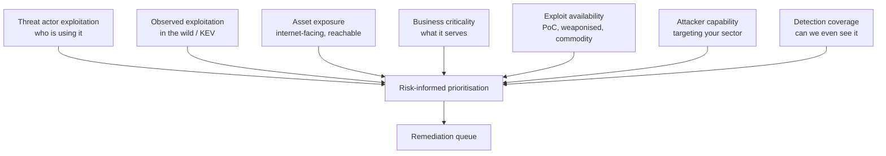
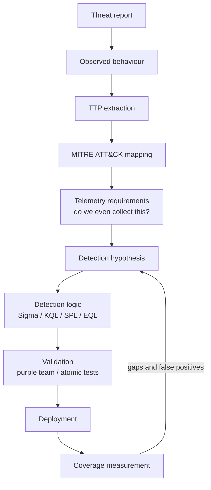
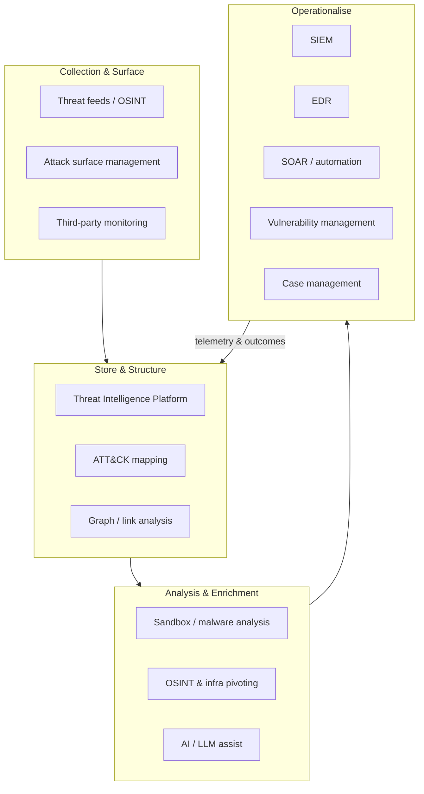
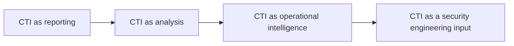

# Building a Cyber Threat Intelligence desk in a normal enterprise

*These are my own views, drawn from building and running intelligence-led security work, not those of any employer, vendor or client. Nothing here is a product endorsement. I've tried to keep the practitioner's discipline of separating what is **fact** (sourced), what is **estimate** (a modelled or reported number), what is **assumption** (a premise I'm carrying) and what is **opinion** (mine). Where the ground is soft, I say so.*

---

## The short version

Most non-financial organisations that build a CTI desk end up copying a big bank, and it doesn't work. A bank's intelligence function is shaped by threats and regulation you don't share, so borrowing its shape gives you the overhead without the fit. A desk earns its keep by reducing uncertainty in decisions that are already being made, usually badly or slowly. It isn't there to produce intelligence as a thing you can file and forget. The most valuable dataset it owns is nearly always internal: what you run, where it sits, who owns it, and what you can already see. External reporting only turns into intelligence when it hits that internal picture and changes something real, a detection, a patch order, an investigation. If an activity never changes what the organisation does, it doesn't belong on the desk, however interesting it is.

---

## 1. Start with the decision, not the discipline

The wrong way to start a CTI desk is the way most people start one: someone reads that CTI is important, a TIP gets bought, feeds get plugged in, and eighteen months later there's a team writing PDFs that a distribution list opens 4% of the time. Nobody set out to build that. It's the default outcome when you build a capability before you've named the decisions it's supposed to improve.

So start with the decisions. Walk the security org and ask what people are guessing at.

- The SOC is triaging alerts with no idea whether the technique in front of them maps to anything targeting your sector this quarter. They lack *context*, not alerts.
- Vulnerability management has 40,000 open findings and a scanner that calls 8,000 of them "critical." They lack *prioritisation grounded in real exploitation*, not CVSS scores.
- Incident response, mid-incident, needs to know whether the infrastructure they're staring at belongs to a known campaign and what that campaign does next. They lack *external context at speed*.
- Security leadership is asked by the board whether "the thing in the news" affects you. They lack *a defensible view of what actually matters to this organisation*.
- Detection engineering is building rules from vendor blogs and vibes. They lack *a prioritised, environment-aware pipeline of what to detect and why*.

Every one of those is a decision being made today, with or without you, usually with too little information. That is the reason a CTI desk exists. Not because intelligence is a good idea in the abstract. Because these specific decisions are worse than they need to be, and intelligence is the cheapest way to improve them.

The reframing I'd push on any security leader: don't ask "should we have CTI?" Ask "which decisions are we currently making blind, and would knowing more actually change the outcome?" If the honest answer to the second half is no, don't fund the intelligence, fund the fix.

---

## 2. Define the mission before you define the team

A CTI desk that hasn't written down what it owns, influences, and refuses to own will drift into being a newsletter. Pin it down early.

**CTI owns** the analytical judgement: what threats matter to *this* organisation, how confident we are, what the adversary is likely to do, and what internal context makes an external report relevant. It owns intelligence requirements and the priority ordering of them.

**CTI influences** detection priorities, vulnerability prioritisation, hunt hypotheses, incident hypotheses, and the security roadmap. Influence, not control. The desk should change what these teams do without owning their backlog.

**CTI should not own** the SIEM, the detection content lifecycle, patching, or incident command. The fastest way to make a CTI desk useless is to let it become a second SOC or a shadow vulnerability-management team. Its leverage is judgement, not operations. The moment it's on the hook for operational delivery, the analysis stops.

Here's how those relationships actually run day to day:

- **SOC.** CTI supplies context and priority. The SOC supplies ground truth about what's firing and what's noise. It's a two-way feed, not a broadcast.
- **Detection engineering.** The most important partnership in the building. CTI turns adversary behaviour into detection requirements, detection engineering builds and owns the logic, and the two of you measure coverage together.
- **Vulnerability management.** CTI adds exploitation and targeting context on top of VM's asset and severity data. VM still owns the process.
- **Incident response.** CTI is on call during incidents to answer the attribution-adjacent and "what happens next" questions. IR owns the incident.
- **Security architecture and red/purple teams.** CTI feeds the threat model that architecture designs against and that purple teams emulate. What the purple team finds comes straight back as detection gaps.
- **Executives.** CTI translates the threat landscape into language leadership can actually decide on. Do this sparingly. A brief that lands monthly and changes a decision beats a weekly one nobody acts on.

### The four kinds of intelligence, and which you actually need

The textbooks list four tiers. They're real enough, but the mistake I keep seeing is small teams trying to staff all four.

- **Strategic.** Long-horizon, aimed at leadership. Who's likely to come after us and why, where the sector is heading, geopolitical exposure. It feeds investment and risk appetite.
- **Operational.** Campaign-level. This actor, this campaign, these behaviours, active now. It feeds what you hunt and detect this month.
- **Tactical.** The TTPs, meaning how the adversary actually operates, mapped to ATT&CK. It feeds what detection and control you build.
- **Technical.** The atomic indicators: hashes, IPs, domains. It feeds what you block and match right now, and it goes stale fast.

Where I'd put the effort: a small function should live in the operational and tactical layers, because that's where intelligence most directly changes detection and response. Treat technical intelligence as something you automate, not something a person babysits. Strategic intelligence is the last thing a small team should try to do by hand, and the first thing a large one has to get right, because once you're big the audience is making decisions about money.

---

## 3. Design the desk around headcount, not an org chart

There's a canonical CTI operating model, and it's fine as a reference. It is not a template to force onto a three-person team.



That diagram describes functions, not people. In a small shop one person wears all three hats before lunch. So design around what you've actually got.

**One person.** This is a broker and prioritiser, not a producer. The whole job is ruthless triage. Subscribe to a handful of high-signal sources, automate anything to do with technical indicators, and spend the human hours answering the two or three standing questions that matter to detection and VM. They'll be tempted to write reports. Talk them out of it. A one-person desk that ships two good detection requirements a week is worth more than one that ships a monthly landscape PDF nobody opens.

**Three people.** Now you can split things up: someone owns collection and enrichment (mostly automated), someone does the analysis, and someone bridges into detection engineering. This is the smallest team that can actually run a feedback loop from report to detection to coverage measurement. Keep strategic output light and reactive.

**Five to ten.** Room to specialise. An actor and campaign tracker, a vulnerability-intelligence analyst, a detection-focused analyst sitting with engineering, an OSINT and infrastructure hunter, and someone who owns products and stakeholders. Strategic intelligence turns into a deliberate output instead of an afterthought.

**Larger enterprise.** Sub-teams by mission, a dedicated tooling and automation function, proper governance around intelligence requirements. The risk flips at this size. Now the failure mode is bureaucracy and sheer volume, not thinness.

The line between what you automate and what stays human holds at every size. Automate the processing and enrichment. Keep the analysis and any consequential call human. Machines are great at pulling entities out of a report and hopeless at deciding whether that report means you're about to have a bad week.

---

## 4. The workflow, and why the traditional one leaks value

The intelligence lifecycle everyone draws:



Every stage matters, but the two that get skipped are the two that create the value. Requirement gets skipped because it's easier to collect than to sit down and decide what you actually need. Operationalisation and feedback get skipped because dissemination feels like the finish line. It isn't. Sending the PDF is where most desks stop, and it's where the value should start.

Put the two operating models side by side.

The traditional path:

```
Raw report -> analyst reads it -> analyst writes a summary -> PDF to stakeholders -> everyone forgets
```

The operational path:

```
Source -> extract entities -> extract behaviours -> map TTPs -> correlate against your environment
       -> identify exposure -> generate detection opportunities -> validate -> deploy -> measure coverage
```

The second model produces something you can point at. A detection that didn't exist yesterday. A patch that jumped the queue for a reason you can defend. A hunt that closed a gap. The first model produces a document. Documents have their place, but a desk measured by documents will optimise for documents, because that's what people do. Measure it by what changed downstream instead, and the whole workflow quietly reorganises itself around operational output. That reorganisation is most of the value. The tooling matters far less than people think.

---

## 5. Collection: fewer, better, and driven by requirements

The instinct is to buy feeds. More feeds feel like more intelligence. They aren't. Every source you add is more enrichment to run, more storage to hold, and more noise for an analyst to wade through. Ten overlapping commercial feeds pushing the same commodity indicators don't give you ten times the signal. They give you ten times the deduplication.

Start from the decision, not the catalogue.

> **What information would materially change a security decision we make?** Then work backwards to the smallest set of sources that supplies it.

Here's the realistic source landscape for a non-financial enterprise, roughly in order of value for money.

- **Internal telemetry.** SOC observations, incident data, VM output, cloud and identity logs. Almost always your highest-signal source, and you already own it. More on this in a moment.
- **Sector ISACs and trust groups.** The intelligence most relevant to you often comes from a peer in your industry who got hit last week. Aviation, energy, health, manufacturing all have sharing communities. Join before you need them, not after.
- **Government intelligence.** National CERT and cyber-centre advisories, so CISA, NCSC and their equivalents. Free, credible, and sometimes ahead of the commercial reporting on nation-state activity.
- **Vulnerability intelligence.** KEV, EPSS, vendor advisories, exploit-availability signals. High signal, low cost.
- **A small number of commercial providers.** Chosen for how well they cover your adversaries and your sector, not for how many feeds they bundle. One or two good ones beat five generic ones.
- **OSINT and security research.** Vendor threat blogs, researcher disclosures, conference talks. Cheap, timely, quality all over the place.
- **The developer ecosystem.** GitHub, package registries, paste sites. Exploit code, tooling, and leaked material relevant to your stack.
- **Supply-chain and third-party intelligence.** Exposure and incidents at your critical suppliers. Underrated, and getting more important every year.
- **Dark web and criminal-forum monitoring.** Genuinely useful for credential leaks and initial-access-broker chatter that names your org. Mostly noise otherwise. Buy it late, and only if you'll actually action it.

The discipline here is subtraction. A source you never action is a source you should cancel. I'd rather run three feeds hard than thirty shallow.

---

## 6. Build the internal dataset, the part nobody wants to do

The uncomfortable truth is that the highest-value intelligence asset in most organisations isn't a feed at all. It's an accurate, current picture of yourself. Almost nobody has one, because building it is unglamorous work that cuts across a dozen teams who all think it's someone else's job.

What you're after is a living model of:

- Assets, who owns them, and which business unit they serve.
- The technology stack, down to vendors, products, and versions.
- Internet-facing exposure, meaning your real attack surface rather than the one in the CMDB.
- Cloud, identity, and critical-application inventory.
- Suppliers and geographic footprint.
- Current vulnerabilities, existing detections, and past incidents.
- Prior attacker activity aimed at you specifically.

Why this is the whole game:

External intelligence, on its own, is trivia:

> "Threat actor X is exploiting vulnerability Y."

The same input, met with internal context, is intelligence that moves work:

> "Threat actor X is exploiting vulnerability Y. We run the affected product, the vulnerable version is live on these fourteen internet-facing assets in the business unit that processes customer orders, and our current detection coverage for the post-exploitation behaviour X uses is limited to one rule that only fires on a code path they don't take."

The second statement gets a patch expedited and a detection built by Friday. The first gets a shrug. The only difference between them is internal context. This is why I'll happily argue that a desk with mediocre feeds and excellent internal data beats one with elite feeds and no real idea what it runs. Where external and internal meet is where the uncertainty actually drops.



Note the right-hand branch. Half the value of internal context is being able to *confidently ignore* things. Knowing you don't run the affected product is intelligence too, and it saves the whole security org from chasing headlines.

---

## 7. CTI × vulnerability management: context, not a second scanner

The lazy version of this integration is "CTI tells VM to prioritise critical CVEs." VM already has severity scores. That adds nothing.

The useful version treats prioritisation as a function of several signals CTI is uniquely placed to supply:



A quick word on the standard signals. CVSS measures theoretical severity in a vacuum, which makes it close to useless for prioritisation on its own. A 9.8 nobody exploits should sit behind a 7.5 that's in every criminal toolkit. KEV, CISA's Known Exploited Vulnerabilities catalogue, is a strong "this is exploited in the wild" signal and a useful forcing function, but it's a floor rather than a strategy, and it lags reality. EPSS, from FIRST, gives you a probabilistic estimate of exploitation that's genuinely handy for triage. Treat it as an estimate, because that's exactly what it is, and remember the number moves. None of the three knows whether you're exposed, or whether an actor going after your sector is actually using the thing. That last part is the context CTI adds.

The framing that keeps this healthy is simple. CTI doesn't run vulnerability management and shouldn't want to. It hands VM a defensible reason to reorder the queue. VM still owns the queue.

---

## 8. CTI × detection engineering: the core loop

This is the section that matters most, because it's where intelligence stops being a document and becomes a control. If your CTI desk has one deep partnership, make it this one.

The pipeline from report to deployed detection:



You build detections from TTPs rather than IOCs because TTPs last. An IP or a hash is only true until the adversary changes it, which is cheap for them and usually automated. A domain might have a shelf life of a few days. A behaviour, say an actor that stages exfiltration by abusing a particular cloud-sync tool, holds up across infrastructure changes, because it reflects how the adversary works, and they change how they work reluctantly. Detecting the behaviour survives them rotating their infrastructure. That's the practical bit of what people mean by climbing the "pyramid of pain": force the adversary to change tradecraft, not just IP addresses.

None of that means IOCs are worthless. They're excellent for high-confidence, low-cost blocking and for looking backwards. Sweep your history for a known-bad hash the moment it drops. Block known C2 at the perimeter. Enrich an alert with reputation. Use IOCs for speed and for covering the known, and build the durable part of your detection strategy on TTPs.

The feedback loop is what turns this into a system instead of a conveyor belt. Detection engineering tells CTI what telemetry actually exists and where coverage is thin. CTI decides which behaviour to tackle next. Purple team exercises drop in as validated gaps. A desk that lobs detection ideas over the wall and never hears back is just guessing.

---

## 9. CTI × incident response: change the investigation, don't decorate it

During an incident the CTI desk earns or loses its reputation in an afternoon. The value is answering, fast, the questions IR can't answer from inside the incident:

- Who might be behind this, and how confident are we?
- Is this behaviour consistent with a known campaign, and if so, what does that campaign do *next*?
- What infrastructure is associated with it, and where else might it touch us?
- What additional telemetry should we pull right now?
- Which other assets share the exposed characteristic?
- Has anyone else been hit by this, and what did they do that worked?

The distinction worth holding onto is between intelligence that's interesting and intelligence that changes the investigation. "This looks like APT-whatever" is interesting, and it's usually a trap. Attribution feels like progress but rarely changes what you do in the next hour. "This actor's habit is to plant a second foothold in identity infrastructure within about two days, so go look here now" changes the investigation. Mid-incident, prefer the second every time. Attribution can wait for the post-mortem. The second foothold can't.

---

## 10. The technology stack: functions first, products never

Don't start from a product shortlist. Start from the functions the desk needs, then decide what you buy, build, or already have.



Here's what each layer is actually for, since the acronyms hide the function.

- **TIP.** The structured memory of the desk. It holds actors, campaigns, TTPs, indicators and the relationships between them, so knowledge compounds instead of living in analysts' heads.
- **SIEM and EDR.** Where intelligence meets reality. This is the telemetry you correlate against and the place you deploy detections.
- **SOAR and automation.** The machinery that handles processing and enrichment so people don't have to.
- **ASM.** Your outside-in view of exposure, which tends to be more honest than the asset inventory.
- **Vulnerability management.** The exposure and severity substrate that CTI adds context to.
- **Sandbox and malware analysis.** Pulling behaviour out of samples.
- **Graph analysis.** Pivoting across infrastructure and relationships. The analyst's power tool.
- **ATT&CK.** The shared language that keeps TTPs consistent across the whole loop.
- **Case management.** Where requirements, investigations and products actually get tracked.

A **minimum viable stack** is your existing SIEM and EDR, a lightweight or open-source TIP (MISP does the job fine), ATT&CK Navigator, a sandbox (a community one is fine to start with), some OSINT tooling, and whatever automation your SOAR or a few scripts already give you. If you're a normal enterprise that already runs a SOC, you can stand this up for close to zero new licensing.

An **enterprise stack** adds a commercial TIP with proper automation, dedicated ASM, premium providers matched to your threat model, a graph platform, a malware-analysis pipeline, mature SOAR, and LLM-assisted workflows. The gap between the two is mostly automation, integration depth and coverage, not some fundamentally different capability. A well-run minimal stack will beat a badly integrated enterprise one every time.

---

## 11. AI and automation: automate processing, assist analysis, keep judgement human

AI is genuinely useful in CTI, and it's also where I see the most dangerous overreach. Both are true. Hold them together.

Where it genuinely helps, today, and reliably:

- Ingesting and normalising reports at volume.
- Pulling entities, infrastructure and behaviours out of unstructured text.
- Drafting ATT&CK mappings, with the emphasis on drafting.
- Clustering related reporting and summarising the firehose.
- Research assistance and natural-language investigation over your own data.
- Drafting detection logic and translating between query languages.

And where it'll quietly hurt you if you let it near a consequential call:

- **Hallucination.** Confident, fluent, wrong. In this work a fabricated infrastructure link or a plausible but false actor connection propagates straight into decisions.
- **False attribution.** These models are pattern-matchers and will happily assert a connection that isn't there. Attribution is exactly the wrong place to trust one.
- **Wrong ATT&CK mapping.** A bad technique mapping points detection engineering at the wrong control. The draft looks right, which is precisely what makes it dangerous.
- **Overconfidence and automation bias.** Analysts trust a fluent summary and skip the check that would have caught the miss.
- **Data leakage and thin provenance.** Sensitive internal context ends up in prompts, and you get outputs you can't trace back to a source.
- **Loss of analyst context.** If the machine does all the reading, the analyst loses the feel for the material that made them good in the first place.

The principle I'd carve above the desk:

> **Automate processing. Assist analysis. Keep consequential judgement human-reviewed.**

In practice, let the machine extract, normalise, cluster and draft. Let a human decide what it means, whether to attribute, what confidence to put on it, and what the organisation should do next. Anything the AI produces that will drive a decision gets a human name against it. That isn't distrust of the tooling. It's keeping accountability where it belongs.

---

## 12. People: not everyone needs to be a reverse engineer

The most common hiring mistake is looking for a single mythical analyst who is simultaneously a malware reverse-engineer, a cloud expert, an intelligence writer, and a detection engineer. That person is rare, expensive, and probably bored by two-thirds of the actual job.

The skills a desk needs, spread across people rather than crammed into one:

- Intelligence analysis and structured judgement, the core craft and the most underrated.
- Threat research and adversary tradecraft.
- Detection engineering fluency.
- Networking, cloud and identity fundamentals.
- Malware analysis, useful but not universal.
- OSINT and infrastructure pivoting.
- Data analysis and light automation.
- Writing and communication, the ability to make a finding land with a busy stakeholder.

Not every analyst has to be deeply technical. The strongest small desks I've seen pair people who cover for each other. There's the analyst who thinks in hypotheses, confidence and adversary intent but isn't the deepest technically. There's the technical researcher who lives in telemetry, malware and infrastructure. And there's the detection-minded engineer who turns judgement into logic. The analyst without the engineer just writes reports. The engineer without the analyst builds detections for the wrong things. You want a bit of friction between them. The results come from the seam where those profiles meet, not from any one of them on their own.

---

## 13. The product: name the decision each one enables

"Reports" is not a product strategy. Every real CTI product should have a named audience, a trigger, and the part people skip, a decision it enables. If you can't name the decision, don't build the product.

| Product | Audience | Trigger | Decision it enables |
|---|---|---|---|
| Flash intelligence | SOC, IR, detection | Urgent, active threat to you | Act now: patch, hunt, or block |
| Threat assessment | Security leadership | New actor/campaign relevant to sector | Where to focus effort this quarter |
| Campaign tracking | Detection, SOC | Ongoing relevant campaign | What to keep detecting and hunting |
| Actor profile | Detection, red team | New priority adversary | What behaviours to emulate and detect |
| Vulnerability intelligence | VM, leadership | High-signal vuln + exploitation | Reorder the remediation queue |
| Detection package | Detection engineering | Analysed behaviour | Deploy a specific, validated detection |
| Hunt package | Threat hunters, SOC | Hypothesis worth testing | Run a scoped hunt with clear success criteria |
| Infrastructure tracking | SOC, IR | Tracked adversary infrastructure | Pre-emptive blocking and correlation |
| Executive assessment | Board, CISO | Periodic or event-driven | Risk appetite and investment |
| Incident support | IR | Active incident | Direct the investigation |
| Intelligence requirements | The desk itself | Standing / reviewed quarterly | What the desk collects and prioritises |

The products near the top of that table change what happens this week. The ones near the bottom change what happens this year. A healthy desk produces from both ends. An unhealthy one produces nothing but executive assessments, because those are the ones the people holding the budget can see. That's the incentive trap, and it's worth watching for.

---

## 14. Measuring the desk without lying to yourself

Vanity metrics are seductive because they're easy to count and always go up: reports written, feeds consumed, IOCs processed. None of them measure whether a decision improved. A desk optimising for "reports written" will write more reports. That's the whole problem.

Measure outcomes instead, even the ones that are harder to count:

- Intelligence requirements answered, and how many are still open.
- Detections created or improved as a direct result of intelligence.
- Vulnerability prioritisations that changed because CTI added context.
- Investigations measurably sped up by CTI input.
- Incidents you materially supported.
- Threat hypotheses tested, including the ones you disproved, which is real work.
- Adversary infrastructure you spotted before it was used against you.
- Time from intelligence to defensive action. If I could keep only one metric, it'd be this one, because it captures the whole point of the desk.
- Intelligence products that provably changed a decision.

I won't pretend every intelligence activity has a clean ROI. Some of the most valuable work has no tidy number attached, like the hypothesis you tested and killed, or the campaign you tracked that never touched you. The honest position is to measure what you can, tell the story of what you can't, and be ruthless about cutting anything that produces neither a measurable outcome nor a changed decision. "It's interesting" is not a metric.

---

## 15. Failure modes, and the reason behind each

Most CTI desks fail in recognisable, avoidable ways. The pattern underneath nearly all of them is *building capability before defining the decision it serves*.

- **Becoming a report-writing team.** Reports are visible and safe, so the desk drifts towards them. Fix it by measuring operational outcomes rather than documents.
- **Buying too many feeds.** More feeds feel like more intelligence and take no analytical courage. Start from requirements, and cancel any source you never action.
- **Building a TIP before defining requirements.** Tooling is easier to buy than clarity. Name the decisions first. The TIP stores knowledge, it doesn't create it.
- **No relationship with detection engineering.** The desk's biggest lever, left idle because the org chart makes it awkward. Sit together or embed someone, and measure coverage jointly.
- **No relationship with vulnerability management.** CTI reinvents severity instead of adding exploitation context. Plug into the prioritisation VM already runs.
- **Treating IOCs as the product.** IOCs are easy to count, so they become the deliverable. Build the durable value on TTPs and use IOCs for speed.
- **Chasing attribution.** It feels like the summit of the craft and rarely changes a decision. Attribute only when it changes what you'll do next.
- **Overproducing executive reports.** They're the output the budget-holder sees, so the incentives pull here. Cap them, and make each one earn its slot with a decision.
- **No internal asset context.** The hard, unglamorous dataset gets skipped, so external intelligence stays trivia. Invest in the internal picture early. It's your highest-leverage asset.
- **No feedback loop.** Intelligence goes out, nothing comes back, and the desk never learns what worked. Instrument dissemination and operationalisation.
- **Automating analysis too aggressively.** Fluent AI output invites over-trust. Automate the processing and keep the judgement human.
- **Building something technically impressive that nobody uses.** The graph platform of your dreams that answers no one's actual question. Every capability should trace back to a decision, or it doesn't get built.

---

## 16. A realistic 90-day build plan

No unlimited budget, no ten-person team on day one. This assumes you're a normal enterprise with an existing SOC and a person or two to point at CTI.

**Days 0 to 30. Requirements and self-knowledge.** Sit down with your stakeholders in the SOC, VM, IR and leadership, and write down the decisions they're currently making blind. Draft a first threat model covering who plausibly targets your sector, your geography and your stack. Inventory the data sources you already have before you buy anything. Start the internal dataset, and don't be precious about it. A rough map of internet-facing assets and critical apps beats nothing. Publish a short, prioritised set of intelligence requirements. No feeds bought yet.

**Days 31 to 60. Collection and first output.** Stand up minimal collection against those requirements: internal telemetry, an ISAC, government advisories, KEV and EPSS, and one commercial source if you can justify it. Wire up basic enrichment and a lightweight TIP. Nail down the workflow. Ship your first operational products, maybe a flash on something live and a vulnerability-intelligence note that reorders a real queue. Build the working relationships with SOC and VM in practice, not on a slide.

**Days 61 to 90. Operationalise and measure.** Now build the detection-engineering loop for real. Take one tracked behaviour all the way to a deployed, validated detection and measure its coverage. Automate the processing you've been doing by hand. Stand up outcome metrics, especially time from intelligence to action. Close your first feedback loops. At this point you've got a working desk, not a slide about one.

After that, the longer horizon:

- **6 months.** The detection loop is routine. The internal dataset is trusted enough that VM and IR reach for it without being asked. You can point to a handful of decisions that measurably changed.
- **12 months.** You're producing deliberate strategic output for leadership, automation handles most of the processing, and you're tracking adversaries that actually matter to you rather than whatever's in the headlines.
- **24 months.** CTI is an input to security engineering and architecture, not a reporter sitting downstream of it. Requirements are reviewed and governed. The desk gets judged by what the organisation does differently because it exists.

---

## What a modern CTI desk should become

The arc I want to leave you with is a maturation, and most desks stall partway along it:



Reporting is where everyone starts, and where too many stay. Summarise the news, send the PDF. Analysis adds judgement: confidence, relevance, what it actually means for us. Operational intelligence wires that judgement into detection, VM and IR so it changes this week's work. Security engineering input is the destination, where intelligence shapes what gets built, monitored and architected, so your defensive posture is a reflection of what your adversaries actually do.

The thing separating each stage from the last is one question, and it's always the same one:

> **Does the intelligence change what the organisation does?**

If it does, you're doing CTI. If it doesn't, if the work is interesting and rigorous and well written and changes nothing, then it's fair to ask whether it belongs on the desk at all. The question is uncomfortable because so much of the work fails it. Ask it anyway, of every product, every feed, every report. It's the cheapest quality control you'll ever get.

---

## Practitioner checklist

A starting checklist you can actually run against. If you can't tick it, you've found your next piece of work.

**Before you build**
- [ ] We've written down the specific security decisions currently made blind.
- [ ] For each, we've confirmed better intelligence would actually change the outcome.
- [ ] We've defined what CTI owns, influences, and explicitly does not own.
- [ ] We've picked the intelligence tiers (strategic/operational/tactical/technical) that match our headcount.

**Collection and context**
- [ ] Collection is driven by requirements, not a feed catalogue.
- [ ] Every source maps to a decision, and anything unactioned gets cancelled.
- [ ] We have a living internal dataset: assets, versions, exposure, detections, history.
- [ ] External intelligence is correlated against internal context before it's called intelligence.

**Operational integration**
- [ ] There is a real, instrumented loop with detection engineering.
- [ ] CTI adds exploitation/targeting context to VM's existing prioritisation.
- [ ] CTI has a defined role and fast answers during incidents.
- [ ] Detections are built from TTPs for durability, with IOCs used for speed and sweeps.

**Tooling and AI**
- [ ] The stack is chosen by function, and starts minimal (SIEM/EDR/TIP/ATT&CK).
- [ ] AI automates processing and drafts analysis, but consequential judgement stays human-reviewed.
- [ ] Every AI-driven, decision-bearing artefact has a human name against it.

**Products and measurement**
- [ ] Every product names an audience, a trigger, and the decision it enables.
- [ ] We measure outcomes (time-to-action, detections created, decisions changed), not vanity counts.
- [ ] We kill activity that produces neither a measurable outcome nor a changed decision.

**The one test**
- [ ] For every activity, we can answer yes to: *does this change what the organisation does?*
